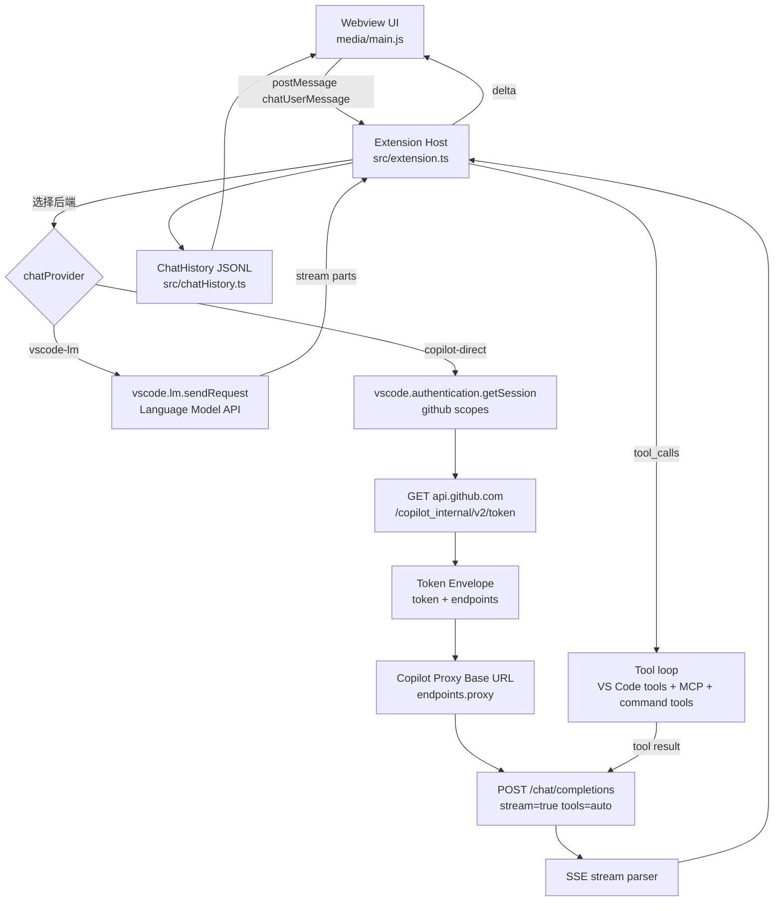

# Tripilot × Copilot Chat：端到端链路图（迁移实现说明）

> 本文目标：
>
> - 把 Copilot Chat（VS Code）的**鉴权 → Token → Domain/Proxy → Chat 请求 → 流式解析 → 工具调用循环**画成可落地的链路图。
> - 给出 Tripilot 内对应模块/文件的映射（便于维护）。
>
> 说明：
>
> - Copilot 的服务端实现/模型本身不在开源范围内；这里描述的是扩展侧与公开/半公开 API 的交互链路。
> - 部分行为属于“实现细节/观察”，会明确标注。

---

## 1. 两种运行模式（Tripilot 选择）

Tripilot 支持两种后端：

- **`vscode-lm`（默认）**：使用 VS Code `vscode.lm` Language Model API，实际 provider 由 VS Code 统一管理（可选 Copilot / 其它 provider 扩展）。
- **`copilot-direct`（新增）**：扩展侧自行完成 GitHub 鉴权 + Copilot Token 交换，并直接请求 Copilot Proxy 的 OpenAI 兼容接口（`/chat/completions`）。

`copilot-direct` 的意义：

- 不依赖 `vscode.lm`（某些发行版/版本可能不可用或行为差异较大）。
- 更贴近 Copilot Chat 扩展的“真实请求链路”（便于对齐 header、错误语义、model 列表）。

---

## 2. 端到端链路图（Mermaid）

---

## 3. Copilot Direct：关键请求与头部（最小集合）

### 3.1 GitHub → Copilot Token

- URL：`https://api.github.com/copilot_internal/v2/token`
- 认证：`Authorization: token <github_session_access_token>`
- 推荐头（实践/观察）：
  - `User-Agent: tripilot-chat/<extVersion>`
  - `X-GitHub-Api-Version: 2022-11-28`
  - `Editor-Version: vscode/<vscode.version>`
  - `Editor-Plugin-Version: tripilot-chat/<extVersion>`

响应（概念）：

- `token`：用于后续 Proxy Bearer
- `endpoints.proxy`：proxy base URL（不同租户/企业可能不同）

### 3.2 Proxy：Chat Completions

- URL：`{proxyBase}/chat/completions`
- 认证：`Authorization: Bearer <copilot_token>`
- SSE：`Accept: text/event-stream`
- 可选：
  - `X-Request-Id`（用于关联日志）
  - `OpenAI-Intent`（例如 `conversation-panel`）

请求体（OpenAI 兼容）：

- `model`
- `messages`
- `stream: true`
- `tools` + `tool_choice: "auto"`（用于工具调用）

---

## 4. Tripilot 实现映射（落地文件）

### 4.1 扩展侧主控

- [src/extension.ts](../../src/extension.ts)
  - UI 通信、会话/历史
  - 工具循环（原有 `vscode.lm` 版本）
  - 新增：`copilot-direct` 版本工具循环与请求

### 4.2 Copilot Direct 模块

- [src/copilotDirect/githubAuth.ts](../../src/copilotDirect/githubAuth.ts)
  - `vscode.authentication.getSession('github', scopes)`
- [src/copilotDirect/copilotTokenManager.ts](../../src/copilotDirect/copilotTokenManager.ts)
  - 调用 GitHub token endpoint、缓存与失效
- [src/copilotDirect/copilotClient.ts](../../src/copilotDirect/copilotClient.ts)
  - `/models`、`/chat/completions` 的最小封装
- [src/copilotDirect/sseParser.ts](../../src/copilotDirect/sseParser.ts)
  - SSE `text/event-stream` 解析

---

## 5. 已知差距（后续可补）

- `/responses` 与 `/v1/messages`（OpenAI Responses / Anthropic Messages）路由：当前先固定 `/chat/completions`。
- 更完整的 Copilot 头部/遥测字段（如 interaction id、HMAC 等）：当前只实现最小可用集。
- 企业 GitHub / GHES：当前默认 dotcom，后续可按 `github-enterprise.uri` 做域名切换。
